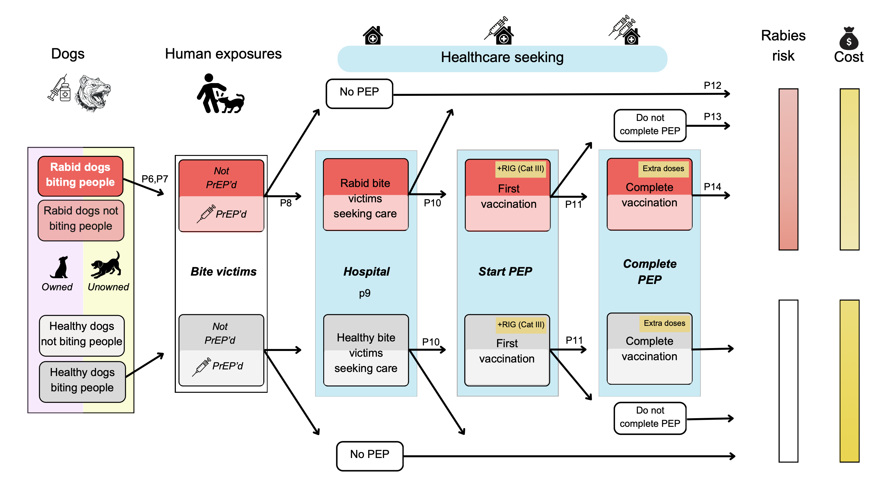

# 🐕 Rabies PrEP Cost-Effectiveness Model
### *A probabilistic decision-tree analysis of rabies prevention strategies in Kerala, India*

---

> **Can pre-exposure prophylaxis close the mortality gap in a setting where post-exposure care is already near-universal?**  





---

## 📌 Overview

Despite providing free post-exposure prophylaxis (PEP) to over 900,000 people annually, Kerala continues to report rabies deaths. This model evaluates whether routine childhood **pre-exposure prophylaxis (PrEP)** — now being actively promoted — offers meaningful population-level benefit, compared to existing strategies such as **mass dog vaccination (MDV)** and optimised PEP schedules.

We simulate 12 intervention scenarios over a **10-year horizon (2026–2035)** using a stochastic probabilistic decision-tree, comparing deaths averted, programme costs, and cost-effectiveness across strategies.

**Key finding:** In a high-PEP-access setting, scaling unowned dog vaccination to 70% coverage reduces rabies deaths by ~81% within three years — at less or comparable cost to universal PrEP.

---

## 📁 Repository Structure

```
PrEP_cost_effectiveness_ms/
│
├── data/                               # Input parameters
│   ├── scenario_parameters_Kerala_general.csv # Base-case and scenario parameter values
│   └── /dog_incidence_model/           # Dog incidence GLM model
│
├── scripts/                     # Core model scripts
│   ├── 01_HelperFun.R         # A set of helper functions
│   ├── 02_decision_tree_incl_PrEP.R          # Main model 
│   ├── 03_model_calibration.R       # Model calibration against surveillance data: dog pop size & healthcare seeking
│   ├── 04_run_model.R           # All 12 intervention scenarios to generate main results
│   ├── 05_visualisation.R         # Graphical outputs 
│   ├── 06_sensitivity_analysis.R  # Sensitivity and uncertainty analyses
│   └── 07_nhb_analysis.R/ 07B_sensitivity_analysis_price         # Net health benefit analysis
│
├── outputs/                     # Model outputs from scenario runs
│   ├── Kerala_general_out.csv     # Median and 95% PI for all scenarios
│   ├── Tables                     # Respective manuscript tables
│   └── manuscript_figures/       # Reproduced manuscript figures
│
└── README.md
```

---

## ⚙️ Requirements

**R version:** ≥ 4.5.3

---

